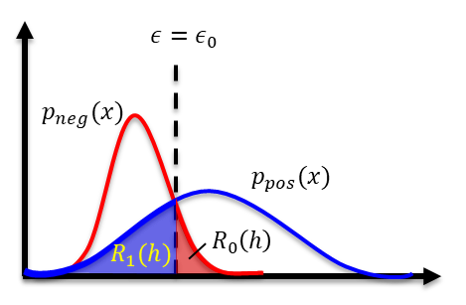

<!-- README.md is generated from README.Rmd. Please edit that file -->

# ovltools 

<!-- badges: start -->

[](https://www.tidyverse.org/lifecycle/#experimental)
[](https://github.com/r-lib/pkgdown/actions)
<!-- badges: end -->

The ovltools is designed to provide some of functions that can calculate
overlap between two sample distributions. You can find some of examples
in <https://psychemistz.github.io/ovltools/>. Learn more in
`vignette("ovltools")`. Currently, this package provides KNN, KDE,
histogram and distribution fitting based overlap calculations.

## Installation

``` r
# Install development version from GitHub
devtools::install_github("psychemistz/ovltools")
```

## Usage

It designed to calculate between two sample distributions.

``` r
## overlap between two normal distributions N(0,1) and N(1,1). n=100. 

x1 = rnorm(100, 0)
x2 = rnorm(100, 1)

## histogram based overlap calculation
OVL = ovl_hist(x1, x2)

## Plot
hist(x1)
hist(x2, add=T)
```

## Author

[Seongyong Park](psychemistz@gmail.com)
