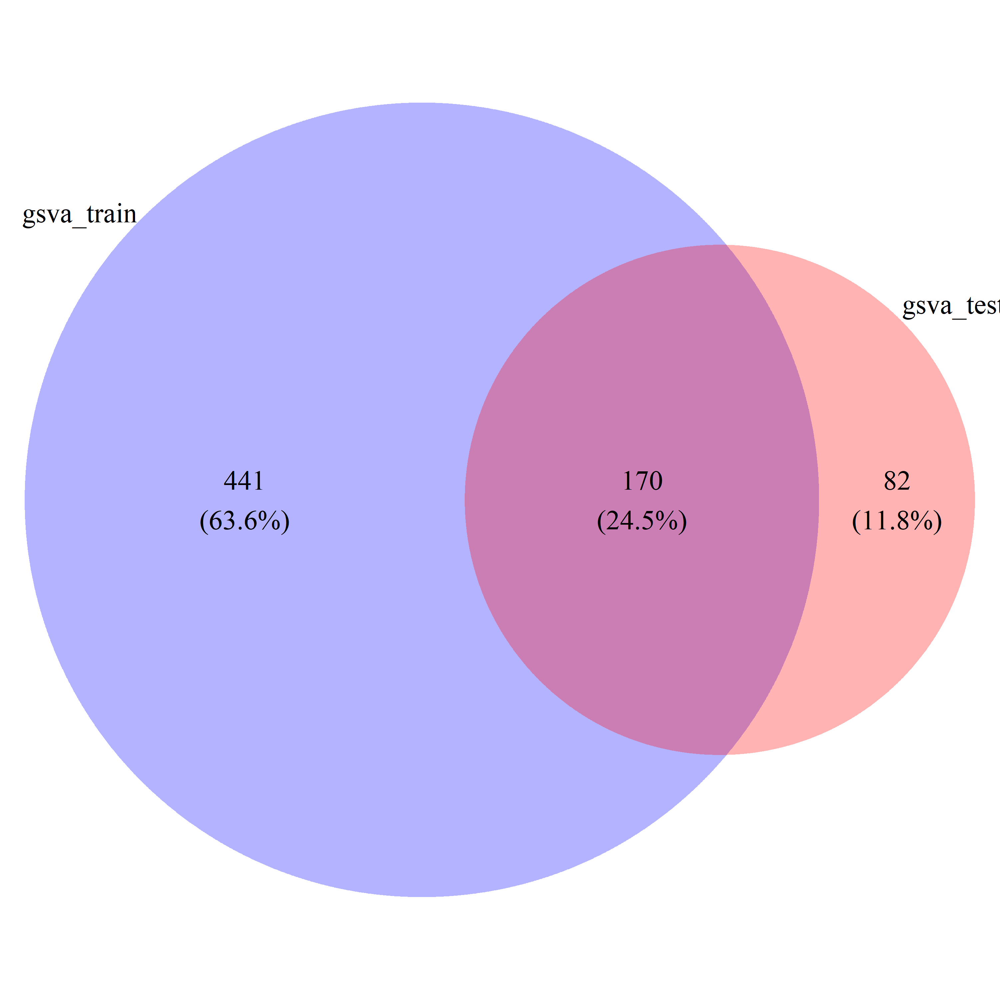
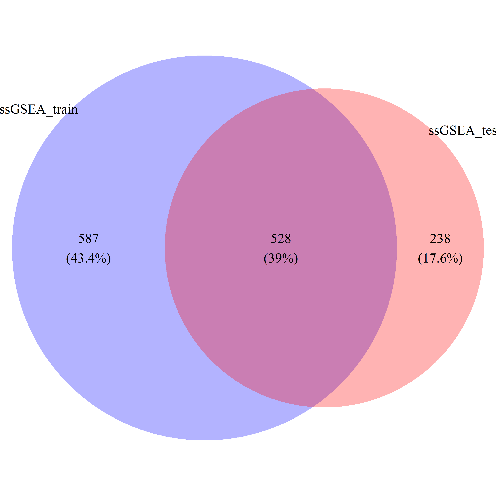
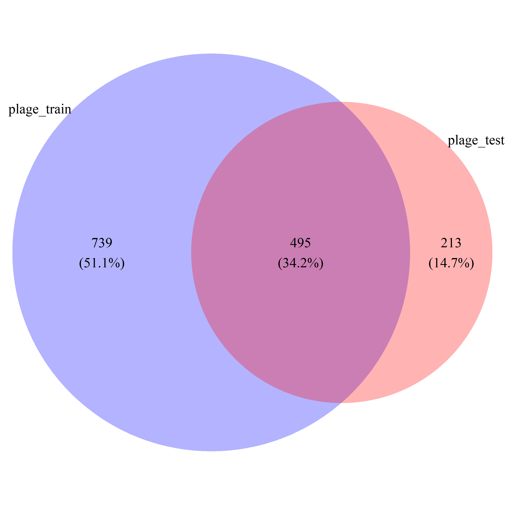
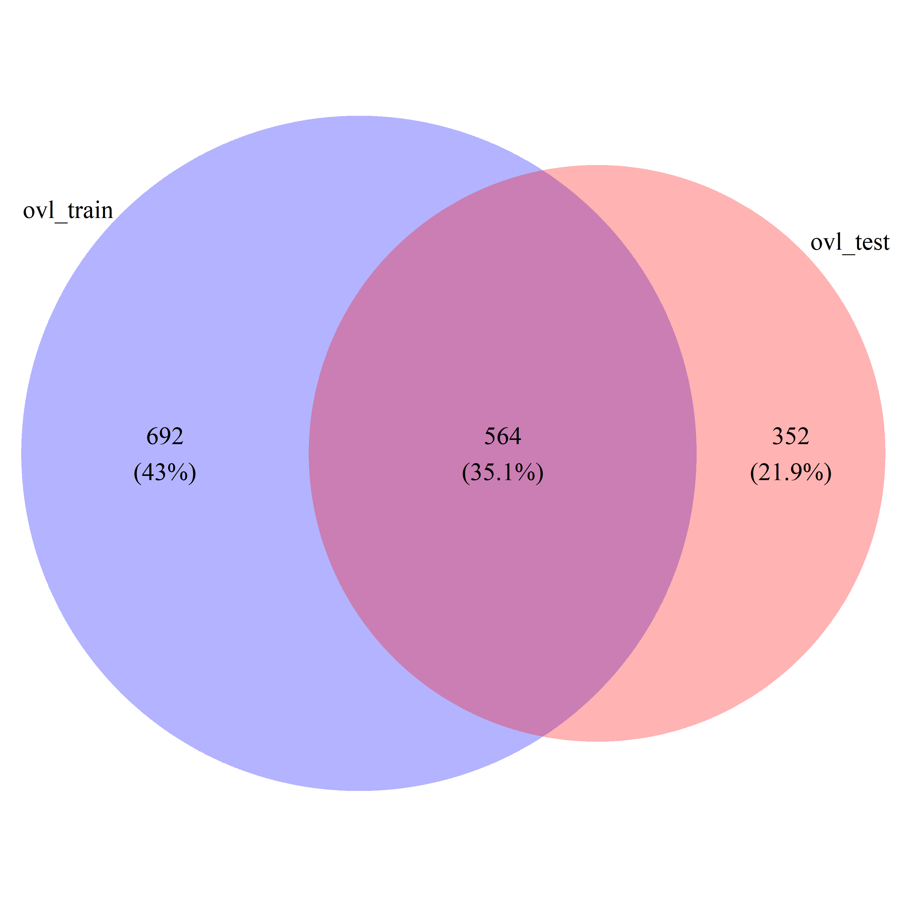
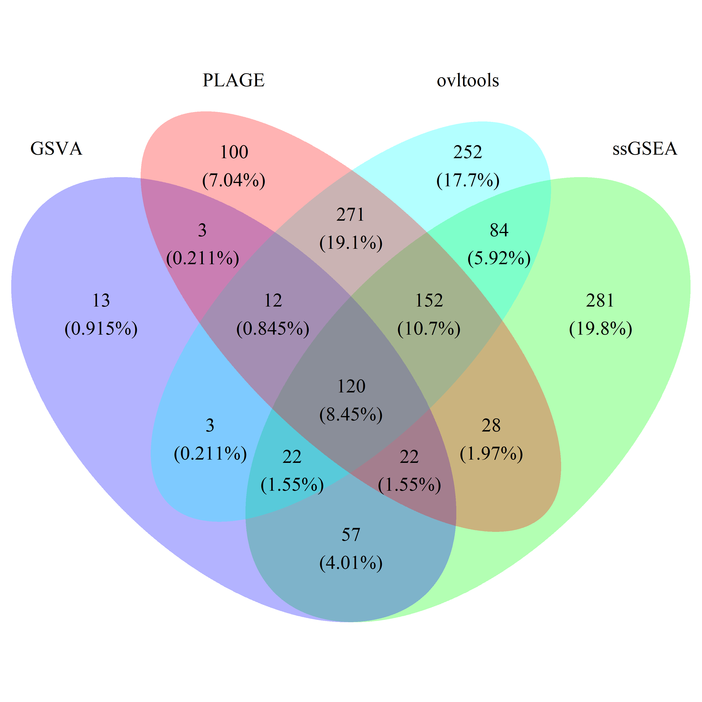

```{r setup, include=FALSE}
knitr::opts_chunk$set(echo = TRUE)
```

## Differentially Active Gene Set Analysis with conventional methods

We often find differentially active gene sets in microarray dataset using some of well known methods. We can also apply overlap statistics for this purpose. Here I compared ovltools with GSVA, ssGSEA, and PLAGE. 

```{r dags_conventional}
suppressPackageStartupMessages(library(golubEsets))
suppressPackageStartupMessages(library(GSVA))

## Load Dataset
suppressPackageStartupMessages(library(dplyr))
data("Golub_Train")
data("Golub_Test")
suppressPackageStartupMessages(library(hu6800.db))

## inspaect
gex_train = Golub_Train@assayData$exprs
gex_test = Golub_Test@assayData$exprs
label_train = Golub_Train@phenoData@data$ALL.AML
label_test = Golub_Test@phenoData@data$ALL.AML

gene_tbl = data.frame(probe_id = names(as.list(hu6800ENTREZID)), Entrez=unlist(as.list(hu6800ENTREZID), use.names = F))
gene_tbl = gene_tbl[complete.cases(gene_tbl),]

## Mapping Gene IDs
gex_train = gex_train %>% as.data.frame() %>% mutate(probe_id = rownames(gex_train)) %>% inner_join(gene_tbl, by="probe_id") %>%
  dplyr::select(-probe_id) %>% group_by(Entrez) %>% summarise_all(list(mean)) %>% as.data.frame()
rownames(gex_train) = gex_train$Entrez
gex_train = gex_train %>% dplyr::select(-Entrez)

## Mapping Gene IDs
gex_test = gex_test %>% as.data.frame() %>% mutate(probe_id = rownames(gex_test)) %>% inner_join(gene_tbl, by="probe_id") %>%
  dplyr::select(-probe_id) %>% group_by(Entrez) %>% summarise_all(list(mean)) %>% as.data.frame()
rownames(gex_test) = gex_test$Entrez
gex_test = gex_test %>% dplyr::select(-Entrez)

## Conventional Gene Set Activity Analysis
# Gene set activity calculation
library(GSVAdata)
library(ovltools)
data(c2BroadSets)
gs = lapply(c2BroadSets@.Data, function(x) x@geneIds)
gs_names = do.call(c, lapply(c2BroadSets@.Data, function(x) x@setName))
names(gs) = gs_names

es.gsva.train <- gsva(as.matrix(gex_train), gs, verbose=FALSE, parallel.sz=1, min.sz=3)
es.ss.train <- gsva(as.matrix(gex_train), gs, method="ssgsea", verbose=FALSE, parallel.sz=1, min.sz=3)
es.plage.train <- gsva(as.matrix(gex_train), gs, method="plage", verbose=FALSE, parallel.sz=1, min.sz=3)

es.gsva.test <- gsva(as.matrix(gex_test), gs, verbose=FALSE, parallel.sz=1, min.sz=3)
es.ss.test <- gsva(as.matrix(gex_test), gs, method="ssgsea", verbose=FALSE, parallel.sz=1, min.sz=3)
es.plage.test <- gsva(as.matrix(gex_test), gs, method="plage", verbose=FALSE, parallel.sz=1, min.sz=3)

# significance of Gene set activity
gsva_limma_res_train = limma_deg(es.gsva.train, label_train)
ss_limma_res_train = limma_deg(es.ss.train, label_train)
plage_limma_res_train = limma_deg(es.plage.train, label_train)

gsva_res_train = gsva_limma_res_train[gsva_limma_res_train$adj.P.Val < 0.05,]
ss_res_train = ss_limma_res_train[ss_limma_res_train$adj.P.Val < 0.05,]
plage_res_train = plage_limma_res_train[plage_limma_res_train$adj.P.Val < 0.05,]

gsva_train_gs = rownames(gsva_res_train)[gsva_res_train$P.Value < 0.05]
ss_train_gs = rownames(ss_res_train)[ss_res_train$P.Value < 0.05]
plage_train_gs = rownames(plage_res_train)[plage_res_train$P.Value < 0.05]


gsva_limma_res_test = limma_deg(es.gsva.test, label_test)
ss_limma_res_test = limma_deg(es.ss.test, label_test)
plage_limma_res_test = limma_deg(es.plage.test, label_test)

gsva_res_test = gsva_limma_res_test[gsva_limma_res_test$adj.P.Val < 0.05,]
ss_res_test = ss_limma_res_test[ss_limma_res_test$adj.P.Val < 0.05,]
plage_res_test = plage_limma_res_test[plage_limma_res_test$adj.P.Val < 0.05,]

gsva_test_gs = rownames(gsva_res_test)[gsva_res_test$P.Value < 0.05]
ss_test_gs = rownames(ss_res_test)[ss_res_test$P.Value < 0.05]
plage_test_gs = rownames(plage_res_test)[plage_res_test$P.Value < 0.05]


gsva_common_gs = intersect(gsva_train_gs, gsva_test_gs)
ss_common_gs = intersect(ss_train_gs, ss_test_gs)
plage_common_gs = intersect(plage_train_gs, plage_test_gs)

gsva_all_gs = union(gsva_train_gs, gsva_test_gs)
ss_all_gs = union(ss_train_gs, ss_test_gs)
plage_all_gs = union(plage_train_gs, plage_test_gs)

```

## Differentially Active Gene Set Analysis with ovltools 

```{r with_ovltools, echo=FALSE}

## GSA based on ovl.test, Train case
# min.sz=3
# res = list()
# for(i in 1:length(gs)){
#   if (i %% 30 == 0) message(paste(i,"/",length(gs)))
#   tmp_dt = gex_train[rownames(gex_train) %in% gs[[i]],]
# 
#   if(dim(tmp_dt)[1] < min.sz) next
#   tmp_dt = t(tmp_dt)
#   pc = prcomp(tmp_dt, center=T, scale.=T)
#   pc_vec = tmp_dt %*% pc$rotation[,1]
#   tmp_res = ovltools::ovl.test(pc_vec[label_train==levels(label_train)[1]], pc_vec[label_train==levels(label_train)[2]], method = 'hist')
#   res[[i]] = c(gs_name = names(gs)[[i]], tmp_res)
# }
# save(res, file="../data/ovl_dags_train_res_ovl_pca.RData")
load("../data/ovl_dags_train_res_ovl_pca.RData")

ovl_train_res = do.call(rbind, res)
ovl_train_res = data.frame(ovl_train_res)
ovl_train_res = ovl_train_res %>% arrange(pval)
ovl_train_gs = ovl_train_res$gs_name[ovl_train_res$pval<0.05]


## GSA based on ovl.test, Test case
# min.sz=3
# res = list()
# for(i in 1:length(gs)){
#   if (i %% 30 == 0) message(paste(i,"/",length(gs)))
#   tmp_dt = gex_test[rownames(gex_test) %in% gs[[i]],]
# 
#   if(dim(tmp_dt)[1] < min.sz) next
# 
#   tmp_dt = t(tmp_dt)
#   pc = prcomp(tmp_dt, center=T, scale.=T)
#   pc_vec = tmp_dt %*% pc$rotation[,1]
#   tmp_res = ovltools::ovl.test(pc_vec[label_test==levels(label_test)[1]], pc_vec[label_test==levels(label_test)[2]], method = 'hist')
#   res[[i]] = c(gs_name = names(gs)[[i]], tmp_res)
# }
# save(res, file="../data/ovl_dags_test_res_ovl_pca.RData")
load("../data/ovl_dags_test_res_ovl_pca.RData")

ovl_test_res = do.call(rbind, res)
ovl_test_res = data.frame(ovl_test_res)
ovl_test_res = ovl_test_res %>% arrange(pval)
ovl_test_gs = ovl_test_res$gs_name[ovl_test_res$pval<0.05]
ovl_common_gs = intersect(ovl_train_gs, ovl_test_gs)
ovl_all_gs = union(ovl_train_gs, ovl_test_gs)
```

## Draw Venn diagram

```{r venn}
# suppressPackageStartupMessages(library(VennDiagram))
# draw_venn(list(gsva_train_gs, gsva_test_gs), cat.name=c("gsva_train", "gsva_test"), f.name="../fig/golub_dags_gsva_VennDiagram.png")
# draw_venn(list(ss_train_gs, ss_test_gs), cat.name=c("ssGSEA_train", "ssGSEA_test"), f.name="../fig/golub_dags_ssgsea_VennDiagram.png")
# draw_venn(list(plage_train_gs, plage_test_gs), cat.name=c("plage_train", "plage_test"), f.name="../fig/golub_dags_plage_VennDiagram.png")
# draw_venn(list(ovl_train_gs, ovl_test_gs), cat.name=c("ovl_train", "ovl_test"), f.name="../fig/golub_dags_ovltools_VennDiagram.png")
# 
# draw_venn(list(gsva_train_gs, ss_train_gs, plage_train_gs, ovl_train_gs),
#           cat.name=c("GSVA", "ssGSEA", "PLAGE", "ovltools"), f.name="../fig/golub_train_dags_VennDiagram.png")
# 
# draw_venn(list(gsva_test_gs, ss_test_gs, plage_test_gs, ovl_test_gs),
#           cat.name=c("GSVA", "ssGSEA", "PLAGE", "ovltools"), f.name="../fig/golub_test_dags_VennDiagram.png")
# 
# draw_venn(list(gsva_common_gs, ss_common_gs, plage_common_gs, ovl_common_gs),
#           cat.name=c("GSVA", "ssGSEA", "PLAGE", "ovltools"), f.name="../fig/golub_common_dags_VennDiagram.png")
# 
# draw_venn(list(gsva_all_gs, ss_all_gs, plage_all_gs, ovl_all_gs),
#           cat.name=c("GSVA", "ssGSEA", "PLAGE", "ovltools"), f.name="../fig/golub_all_dags_VennDiagram.png")


# ovl_test_res %>% filter(gs_name %in% commonset) %>% arrange(desc(OVL))
```

### Methods

**GSVA**: {width=50%}

**ssGSEA**: {width=50%}

**PLAGE**: {width=50%}

**ovltools**: {width=50%}

### Datasets

**Train**: {width=50%}

**Test**: {width=50%}

**Common**: {width=50%}

**All**: {width=50%}
