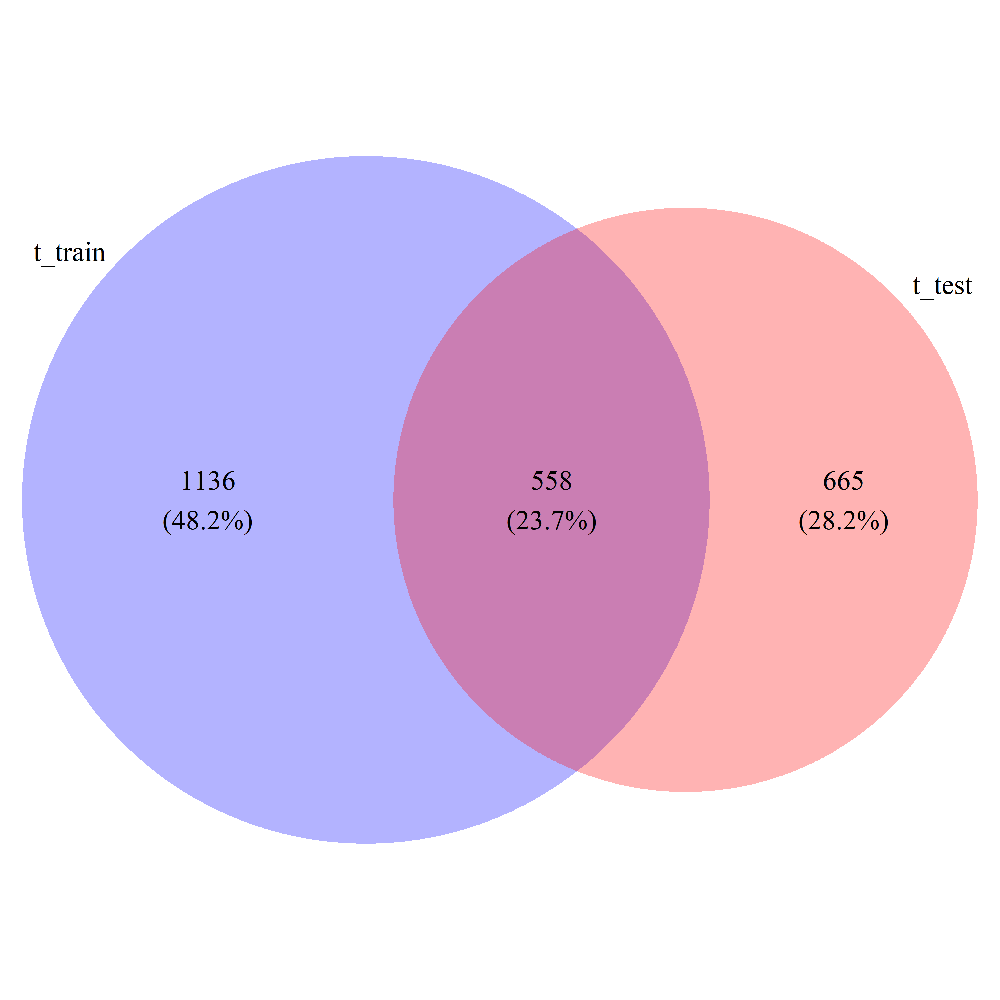
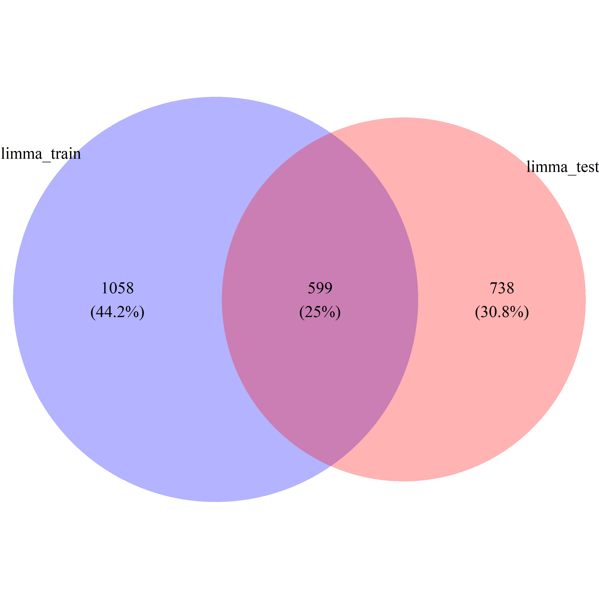
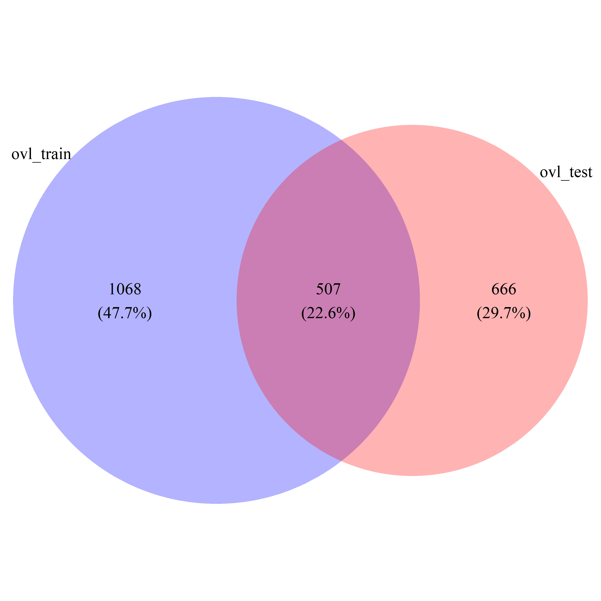
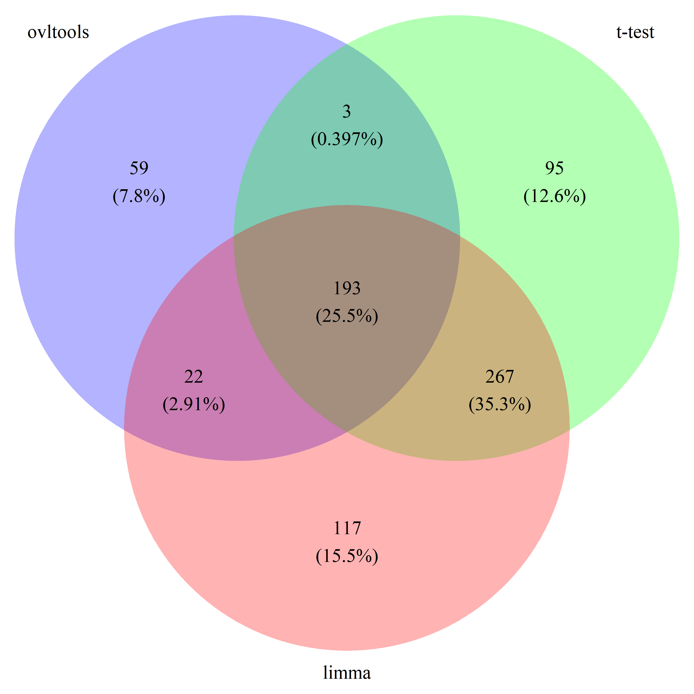
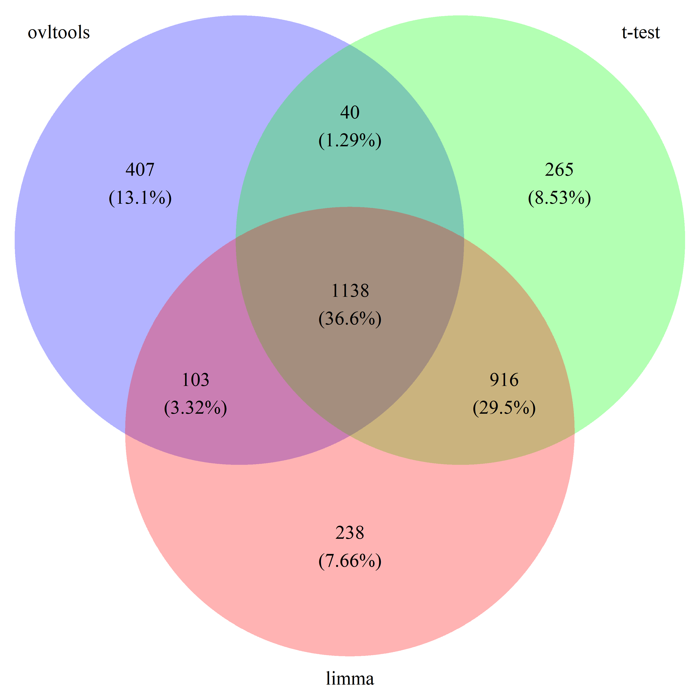

```{r setup, include=FALSE}
knitr::opts_chunk$set(echo = TRUE)
```

## Differential Gene Expression Analysis with conventional methods

```{r deg_with_conventional, echo=FALSE}
suppressPackageStartupMessages(library(golubEsets))
data("Golub_Train")
data("Golub_Test")

## inspaect
gex_train = Golub_Train@assayData$exprs
gex_test = Golub_Test@assayData$exprs
label_train = Golub_Train@phenoData@data$ALL.AML
label_test = Golub_Test@phenoData@data$ALL.AML

## DEG Recovery Test from Train and Test Datasets (t-test)
library(parallel)
library(doParallel)

no_cores <- detectCores(logical = TRUE)
cl <- makeCluster(no_cores-1)
registerDoParallel(cl)
clusterExport(cl, list('gex_train', 'label_train'))

fx <- function(i){c(t.test(gex_train[i, label_train=="ALL"], gex_train[i, label_train=="AML"])$statistic,
                    t.test(gex_train[i, label_train=="ALL"], gex_train[i, label_train=="AML"])$p.value)}

ngenes= dim(gex_train)[1]

system.time(
  results_train <- c(parLapply(cl,1:ngenes,fun=fx))
)

fx <- function(i) {c(t.test(gex_test[i, label_test=="ALL"], gex_test[i, label_test=="AML"])$statistic,
                     t.test(gex_test[i, label_test=="ALL"], gex_test[i, label_test=="AML"])$p.value)}

ngenes= dim(gex_test)[1]

clusterExport(cl, list('gex_test', 'label_test'))

system.time(
  results_test <- c(parLapply(cl,1:ngenes,fun=fx))
)

library(dplyr)
t_train_res = do.call(rbind,results_train)
colnames(t_train_res) = c("t", "pval")
t_train_res = data.frame(t_train_res)
t_train_res$fdr = p.adjust(t_train_res$pval)
t_train_res$id = rownames(gex_train)
t_train_res = t_train_res %>% dplyr::select(id, t, pval, fdr) %>% arrange(pval)


t_test_res = do.call(rbind,results_test)
colnames(t_test_res) = c("t", "pval")
t_test_res = data.frame(t_test_res)
t_test_res$fdr = p.adjust(t_test_res$pval)
t_test_res$id = rownames(gex_test)
t_test_res = t_test_res %>% dplyr::select(id, t, pval, fdr) %>% arrange(pval)


t_DEG_train = t_train_res$id[t_train_res$pval < 0.05]
t_DEG_test = t_test_res$id[t_test_res$pval < 0.05]
t_DEG_common = intersect(t_train_res$id[t_train_res$pval < 0.05], t_test_res$id[t_test_res$pval < 0.05])
t_DEG_all = union(t_train_res$id[t_train_res$pval < 0.05], t_test_res$id[t_test_res$pval < 0.05])
t_ratio = length(t_DEG_common) / length(t_DEG_all)

## DEG Recovery Test from Train and Test Datasets (Limma)
library(ovltools)
limma_train_res = limma_deg(gex_train, label_train)
limma_train_res$id = rownames(limma_train_res)
limma_test_res = limma_deg(gex_test, label_test)
limma_test_res$id = rownames(limma_test_res)

limma_DEG_train = limma_train_res$id[limma_train_res$P.Value < 0.05]
limma_DEG_test = limma_test_res$id[limma_test_res$P.Value < 0.05]
limma_DEG_common = intersect(limma_train_res$id[limma_train_res$P.Value < 0.05], limma_test_res$id[limma_test_res$P.Value < 0.05])
limma_DEG_all = union(limma_train_res$id[limma_train_res$P.Value < 0.05], limma_test_res$id[limma_test_res$P.Value < 0.05])
limma_ratio = length(limma_DEG_common) / length(limma_DEG_all)

```


## Differential Gene Expression Analysis with ovltools

We often find differentially expressed genes in microarray dataset using t-test or limma. We can also apply overlap statistics for this purpose. 

```{r expression dataset}
## DEG Recovery Test from Train and Test Datasets (ovltools)

# no_cores <- detectCores(logical = TRUE)
# cl <- makeCluster(no_cores-1)
# registerDoParallel(cl)
# clusterExport(cl, list('gex_train', 'label_train'))

## DEG in train dataset
# fx <- function(i){ovltools::ovl.test(gex_train[i, label_train=="ALL"], gex_train[i, label_train=="AML"], method="distfit")}
# ngenes= dim(gex_train)[1]
# results_train <- c(parLapply(cl,1:ngenes,fun=fx))
# save(results_train, file="../data/ovl_res_train_golub.RData")
load("../data/ovl_res_train_golub.RData")

## DEG in test dataset
# clusterExport(cl, list('gex_test', 'label_test'))
# 
# fx <- function(i) {ovltools::ovl.test(gex_test[i, label_test=="ALL"], gex_test[i, label_test=="AML"], method="distfit")}
# ngenes= dim(gex_test)[1]
# results_test <- c(parLapply(cl,1:ngenes,fun=fx))
# save(results_test, file="../data/ovl_res_test_golub.RData")
load("../data/ovl_res_test_golub.RData")

## Prepare Result Table
ovl_train_res = do.call(rbind,results_train)
colnames(ovl_train_res) = c("OVL", "pval")
ovl_train_res = data.frame(ovl_train_res)
ovl_train_res$fdr = p.adjust(ovl_train_res$pval)
ovl_train_res$id = rownames(gex_train)
ovl_train_res = ovl_train_res %>% dplyr::select(id, OVL, pval, fdr) %>% arrange(pval)

ovl_test_res = do.call(rbind,results_test)
colnames(ovl_test_res) = c("OVL", "pval")
ovl_test_res = data.frame(ovl_test_res)
ovl_test_res$fdr = p.adjust(ovl_test_res$pval)
ovl_test_res$id = rownames(gex_test)
ovl_test_res = ovl_test_res %>% dplyr::select(id, OVL, pval, fdr) %>% arrange(pval)

ovl_DEG_train = ovl_train_res$id[ovl_train_res$pval < 0.05]
ovl_DEG_test = ovl_test_res$id[ovl_test_res$pval < 0.05]
ovl_DEG_common = intersect(ovl_train_res$id[ovl_train_res$pval < 0.05], ovl_test_res$id[ovl_test_res$pval < 0.05])
ovl_DEG_all = union(ovl_train_res$id[ovl_train_res$pval < 0.05], ovl_test_res$id[ovl_test_res$pval < 0.05])
ovl_ratio = length(ovl_DEG_common) / length(ovl_DEG_all)
```


## Draw Venn diagrams

```{r venn, echo=FALSE}
# draw_venn(list(ovl_DEG_train, ovl_DEG_test), cat.name=c("ovl_train", "ovl_test"), f.name="../fig/golub_deg_ovltools_VennDiagram.png")
# draw_venn(list(t_DEG_train, t_DEG_test), cat.name=c("t_train", "t_test"), f.name="../fig/golub_deg_t_VennDiagram.png")
# draw_venn(list(limma_DEG_train, limma_DEG_test), cat.name=c("limma_train", "limma_test"), f.name="../fig/golub_deg_limma_VennDiagram.png")
# 
# draw_venn(list(ovl_DEG_train, t_DEG_train, limma_DEG_train), cat.name=c("ovltools", "t-test", "limma"), f.name="../fig/golub_train_deg_VennDiagram.png")
# draw_venn(list(ovl_DEG_test, t_DEG_test, limma_DEG_test), cat.name=c("ovltools", "t-test", "limma"), f.name="../fig/golub_test_deg_VennDiagram.png")
# draw_venn(list(ovl_DEG_common, t_DEG_common, limma_DEG_common), cat.name=c("ovltools", "t-test", "limma"), f.name="../fig/golub_common_deg_VennDiagram.png")
# draw_venn(list(ovl_DEG_all, t_DEG_all, limma_DEG_all), cat.name=c("ovltools", "t-test", "limma"), f.name="../fig/golub_all_deg_VennDiagram.png")
```

### Methods

- **t-test**: {width=50%}

- **Limma**: {width=50%}

- **ovltools**: {width=50%}

### Datasets

- **Train**: {width=50%}

- **Test**: {width=50%}

- **Common**: {width=50%}

- **All**: {width=50%}
